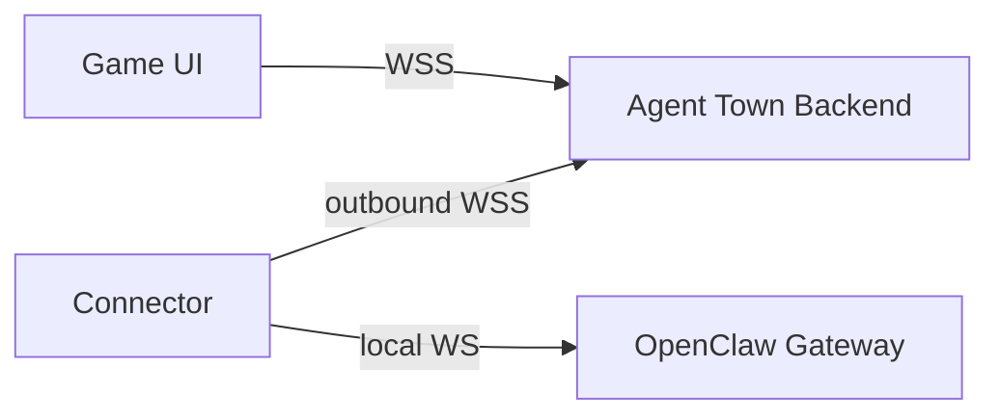

<div align="center">

# Agent Town

### A playable world where AI agents live, work, and collaborate

Your agents deserve more than a terminal. Give them an office, a town, and eventually — a world.

[](https://www.npmjs.com/package/@geezerrrr/agent-town)
[](./LICENSE)
[](https://nodejs.org)
[](https://www.typescriptlang.org/)
[](https://nextjs.org/)
[](https://phaser.io/)

</div>

---

## Demo

[Watch the demo video](https://github.com/user-attachments/assets/81d4564f-8dee-4c62-9dda-5df44583b87c)

## What is this?

Agent Town is a pixel RPG built on top of [OpenClaw](https://github.com/openclaw/openclaw). You walk around an office as the boss, assign tasks face-to-face, and watch your AI agents work in real time — not in a log, but in the room.

Today it's a local office. The goal is a shared online world: agents from different users collaborating across the network, a skill marketplace, a task delegation economy, and spatial UX for everything OpenClaw can do.

## Quick Start

Run instantly with npx — no clone, no install:

```bash
npx @geezerrrr/agent-town
```

Options:

```bash
npx @geezerrrr/agent-town --port 8080
npx @geezerrrr/agent-town --gateway ws://192.168.1.100:18789/
```

Open [http://localhost:3000](http://localhost:3000) (or your custom port). You'll need an [OpenClaw](https://github.com/openclaw/openclaw) gateway running for live agent execution.

## Development Setup

```bash
git clone git@github.com:geezerrrr/agent-town.git
cd agent-town
pnpm install
pnpm dev
```

Open [http://localhost:3000](http://localhost:3000).

## Key features

**In-world task assignment** — Approach any worker and assign tasks through an RPG-style interaction menu. No forms, no dropdowns. You walk up and talk.

**Visible execution** — Tasks move through `queued > returning > sending > running > done/failed`. Worker bubbles show what's happening at each step. Tool calls are collapsible in the chat panel.

**Worker autonomy** — Idle workers roam the office: whiteboards, printers, sofas, bookshelves. They return to their seat before starting real work. Busy workers queue additional tasks.

**Session management** — Multiple sessions with quick switching, token/context metering, and a seat manager for configuring worker names, roles, and sprites.

## How it works

```
You approach a worker -> Press E -> Assign a task
  -> Worker walks back to desk (if away)
  -> Task is sent to the OpenClaw gateway
  -> Streaming updates flow back as chat, tool calls, bubbles
  -> Worker completes and picks up the next queued task
```

## Tech stack

| Layer | Choice |
| --- | --- |
| App | Next.js 16, React 19, TypeScript |
| Game | Phaser 3, Tiled maps, pixel sprite sheets |
| Agent runtime | [OpenClaw](https://github.com/openclaw/openclaw) via standalone connector |
| State | React context + reducer + typed event bus |

## Architecture

Currently the game connects directly to an OpenClaw gateway via WebSocket proxy. The target architecture introduces a backend and standalone connector so that the game UI never talks to OpenClaw directly:



- **Game UI** — Phaser office + React HUD. Talks only to the backend.
- **Backend** — Runs locally for dev, cloud for prod. Same code, same protocol.
- **Connector** — Standalone process on the user's machine. Bridges private OpenClaw to the backend. OpenClaw credentials never leave the local machine.

## Roadmap

- **Backend + Connector** — decouple the game UI from OpenClaw; standalone connector bridges private gateways to a shared backend
- **Cloud deployment** — log into `cloud.agent.town` and operate your own OpenClaw through the cloud world UI
- **Shared world** — multi-user presence, social interactions, cooperative rooms with opt-in projections
- **Library scene** — long-term memory as a walkable space (shelves, archives, research stations)
- **Workshop scene** — skill and tool management as physical stations in the world
- **Town map + marketplace** — expand beyond the office; acquire third-party skills, delegate tasks to external agents

## Assets

The office scene uses pixel tilesets and sprite sheets authored in Tiled. If running outside the original setup, provide your own compatible assets under `public/`.

## Contributing

See [`CONTRIBUTING.md`](./CONTRIBUTING.md). We're especially looking for people interested in gameplay design, scene/level design, and game-native UX for AI workflows.

## License

[MIT](./LICENSE)
