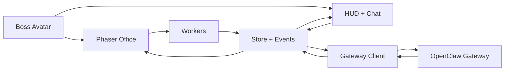

<div align="center">

# Agent Town

### A pixel office where AI agents actually work

Walk around a shared office, talk to your team, assign tasks face-to-face, and watch the work happen — not in a log, but in the room.

</div>

---

## Demo

[Watch the demo video](https://github.com/user-attachments/assets/81d4564f-8dee-4c62-9dda-5df44583b87c)

## What is this?

Agent Town turns AI agent orchestration into a playable pixel office. Instead of dashboards and task queues, your agents sit at desks, roam to the whiteboard, grab coffee, and visibly work through whatever you throw at them.

You play the boss. Walk up to a worker, press `E`, give them a job. If they're away from their desk, they walk back first. If they're already busy, the task queues up. Everything — sending, running, tool calls, completion — plays out on screen.

## Key features

**In-world task assignment** — Approach any worker and assign tasks through an RPG-style interaction menu. No forms, no dropdowns. You walk up and talk.

**Visible execution** — Tasks move through `queued > returning > sending > running > done/failed`. Worker bubbles show what's happening at each step. Tool calls are collapsible in the chat panel.

**Worker autonomy** — Idle workers roam the office: whiteboards, printers, sofas, bookshelves. They return to their seat before starting real work. Busy workers queue additional tasks.

**Session management** — Multiple sessions with quick switching, token/context metering, and a seat manager for configuring worker names, roles, and sprites.

## How it works

```
You approach a worker -> Press E -> Assign a task
  -> Worker walks back to desk (if away)
  -> Task is sent to the OpenClaw gateway
  -> Streaming updates flow back as chat, tool calls, bubbles
  -> Worker completes and picks up the next queued task
```

## Tech stack

| Layer | Choice |
| --- | --- |
| App | Next.js 16, React 19, TypeScript |
| Game | Phaser 3, Tiled maps, pixel sprite sheets |
| Gateway | [OpenClaw](https://github.com/anthropics/openclaw) via WebSocket proxy |
| State | React context + reducer + typed event bus |

## Architecture



## Getting started

```bash
pnpm install
pnpm dev
```

Open [http://localhost:3000](http://localhost:3000). You'll need an [OpenClaw](https://github.com/anthropics/openclaw) gateway running for live agent execution.

## Assets

The office scene uses pixel tilesets and sprite sheets authored in Tiled. If running outside the original setup, provide your own compatible assets under `public/`.

## Roadmap

- **Library scene** — long-term memory as a walkable space (shelves, archives, research stations)
- **Workshop scene** — skill and tool management as physical stations in the world
- **Town map + marketplace** — expand beyond the office; acquire third-party skills, delegate tasks to external agents
- Richer worker personalities and schedules
- Better onboarding for first-time players

## Contributing

See [`CONTRIBUTING.md`](./CONTRIBUTING.md). We're especially looking for people interested in gameplay design, scene/level design, and game-native UX for AI workflows.
