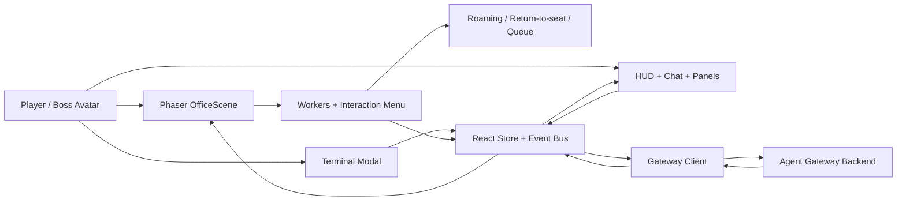

<div align="center">

# Agent World

### A playable AI workspace in a pixel-art office

Walk up to an employee, press `E`, assign work in-world, and watch tasks move through a visible simulation instead of a hidden queue.

</div>

---

## Demo

A short walkthrough of the current gameplay loop and agent workflow:

[Watch the demo video](https://github.com/user-attachments/assets/81d4564f-8dee-4c62-9dda-5df44583b87c)

## Overview

`Agent World` explores what an AI workspace looks like when it behaves more like a small simulation than a dashboard.

Instead of treating agents as rows in a list, the project places them in a shared office. Workers have desks, movement, interruptions, queues, chat bubbles, and visible task states. You walk around the map, talk to specific workers, and see work happen in the world instead of behind the UI.

## Core Ideas

- **Tasks belong to workers**: you assign work to a specific character, not to a generic backend slot.
- **Movement matters**: if a worker is away from the desk, they return before real work starts.
- **State is visible**: queueing, returning, sending, running, completion, and failure all show up in the UI.
- **The interface lives inside the game**: chat, sessions, tool calls, worker state, and token usage are part of the HUD.
- **Chinese and English both work well**: the UI and in-world bubbles support mixed-language content with a pixel font setup.

## Feature Highlights

### In-world assignment
- Walk the boss avatar around the office.
- Approach any employee to trigger `Press E`.
- Open an RPG-style interaction menu.
- Assign work to a specific worker instead of a random backend slot.

### Worker simulation
- Idle workers roam to office POIs such as whiteboards, printers, bookshelves, water coolers, and sofas.
- Workers can be interrupted when it makes sense.
- Workers return to their exact seat and facing direction before starting real work.
- Busy workers can queue additional tasks instead of being reassigned.

### Execution visibility
- Tasks move through explicit states: `queued`, `returning`, `sending`, `running`, `done`, `failed`.
- Worker bubbles show staging, thinking, tool activity, and results.
- Tool calls can be collapsed in chat.
- Replies are attributed to the actual worker handling the task.

### Session-aware control room
- Multi-session support with quick switching.
- Session previews and token/context meter.
- Seat manager for worker names, roles, and sprite assignment.
- Terminal modal for targeted worker assignment.

## How It Works

```text
Player approaches worker
-> Press E
-> Assign Task
-> task is attached to that worker
-> if worker is away, state becomes returning
-> worker walks back to desk
-> task is sent to the gateway
-> state becomes sending / running
-> chat, tool output, and worker bubbles update live
-> worker completes or moves to the next queued task
```

## Tech Stack

| Area | Stack |
| --- | --- |
| Frontend | `Next.js 16`, `React 19`, `TypeScript` |
| Game layer | `Phaser 3` |
| UI | custom HUD + `Tailwind CSS 4` + `shadcn/ui` |
| Runtime | local gateway proxy via `server.ts` |
| State | React context + reducer + typed event bus |
| Content | Tiled maps, object layers, sprite sheets, pixel fonts |

## Architecture



## Getting Started

### Requirements

- `Node.js 22+`
- `pnpm`
- a compatible gateway backend

### Install

```bash
pnpm install
```

### Run in development

```bash
pnpm dev
```

Open [http://localhost:3000](http://localhost:3000).

### Production build

```bash
pnpm build
pnpm start
```

## Gateway Integration

The app expects a gateway-compatible backend that provides:

- agent execution
- streaming assistant events
- streaming tool events
- session listing
- session preview
- model metadata / context limits

The local dev server proxies requests through `server.ts`.

## Assets

The project is built around a pixel office scene composed from:

- office tilesets
- character sprite sheets
- Tiled-authored collision, object, and POI layers

If you want to run this project outside the original setup, provide your own compatible assets under `public/`.

## Why This Exists

Most AI interfaces flatten work into:

- forms
- logs
- tabs
- invisible background work

`Agent World` tries the opposite:

- workers are characters
- tasks happen in a place
- queues are visible
- movement matters
- execution is easier to follow

The goal is not just to make AI work look different. The goal is to make it easier to understand who is doing what, what is blocked, and what happens next.

## Current Status

This repository is a working prototype with a playable office loop and a real gateway-driven execution pipeline.

Recent focus areas:

- collision-safe worker roaming
- proximity interaction design
- delayed send-until-return-to-seat task flow
- multi-session UX
- tool output presentation
- pixel-font rendering for Chinese text

## Roadmap

- **Library scene** for memory management
  - turn long-term memory into an in-world system players can walk through
  - organize memory as shelves, archives, or research stations instead of hidden records
- **Workshop / Tool Room scene** for skills and tools
  - manage installed skills, tools, and execution capabilities as physical stations
  - make tool loadout feel like part of the world instead of a settings page
- **World map + marketplace layer**
  - expand beyond the office into a larger map
  - acquire or install third-party skills, tools, plugins, and related capabilities through shop-like interactions
  - support task commissions and outsourced work as part of the world
- richer worker personalities and schedules
- better office events and environmental interactions
- stronger seat / worker management tools
- more explicit replay and history views
- improved onboarding for first-time users

## Contributing

Contributions are welcome. Please read [`CONTRIBUTING.md`](./CONTRIBUTING.md) before opening a pull request.

We are especially interested in contributors working on:

- gameplay and systems design
- scene / level design
- environmental storytelling for office and non-office spaces
- UI/UX for game-native AI workflows
