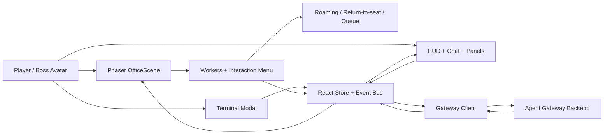

<div align="center">

# Agent World

### A playable AI workspace in a pixel-art office

Walk up to an employee, press `E`, assign work in-world, and watch tasks move through a visible simulation instead of a hidden queue.

</div>

---

## Overview

`Agent World` is an experiment in making AI workflows feel spatial, legible, and alive.

Instead of treating agents as abstract rows in a dashboard, this project turns them into characters inside a shared office. Workers have desks, movement, interruptions, task queues, proximity interaction, chat bubbles, and visible execution states. The result is part game, part control room, and part AI interface.

## Core Ideas

- **Spatial interaction**: you assign work by walking to a worker, not by selecting from a list.
- **Embodied task flow**: workers return to their desks before work is actually sent to the gateway.
- **Visible orchestration**: queueing, returning, sending, running, completion, and failure are all surfaced in the UI.
- **Game-native interface**: chat, sessions, tool calls, worker state, and token usage are integrated into an RPG-style HUD.
- **Bilingual pixel UI**: both the web HUD and in-world bubbles support Chinese/English content with a pixel font pipeline.

## Feature Highlights

### In-world assignment
- Walk the boss avatar around the office.
- Approach any employee to trigger `Press E`.
- Open an RPG-style interaction menu.
- Assign work to a specific worker instead of a random backend slot.

### Worker simulation
- Idle workers roam to office POIs such as whiteboards, printers, bookshelves, water coolers, and sofas.
- Workers can be interrupted when appropriate.
- Workers return to their exact seat and facing direction before starting real work.
- Busy workers can queue additional tasks instead of being reassigned.

### Execution visibility
- Tasks move through explicit states: `queued`, `returning`, `sending`, `running`, `done`, `failed`.
- Worker head bubbles show staging, thinking, tool activity, and results.
- Tool calls can be collapsed in chat.
- Replies are attributed to the actual worker handling the task.

### Session-aware control room
- Multi-session support with quick switching.
- Session previews and token/context meter.
- Seat manager for worker names, roles, and sprite assignment.
- Terminal modal for targeted worker assignment.

## How It Works

```text
Player approaches worker
-> Press E
-> Assign Task
-> task is attached to that worker
-> if worker is away, state becomes returning
-> worker walks back to desk
-> task is sent to the gateway
-> state becomes sending / running
-> chat, tool output, and worker bubbles update live
-> worker completes or moves to the next queued task
```

## Tech Stack

| Area | Stack |
| --- | --- |
| Frontend | `Next.js 16`, `React 19`, `TypeScript` |
| Game layer | `Phaser 3` |
| UI | custom HUD + `Tailwind CSS 4` + `shadcn/ui` |
| Runtime | local gateway proxy via `server.ts` |
| State | React context + reducer + typed event bus |
| Content | Tiled maps, object layers, sprite sheets, pixel fonts |

## Architecture



## Getting Started

### Requirements

- `Node.js 22+`
- `pnpm`
- a compatible gateway backend

### Install

```bash
pnpm install
```

### Run in development

```bash
pnpm dev
```

Open [http://localhost:3000](http://localhost:3000).

### Production build

```bash
pnpm build
pnpm start
```

## Gateway Integration

The app expects a gateway-compatible backend that provides:

- agent execution
- streaming assistant events
- streaming tool events
- session listing
- session preview
- model metadata / context limits

The local dev server proxies requests through `server.ts`.

## Assets

The project is designed around a pixel office scene composed from:

- office tilesets
- character sprite sheets
- Tiled-authored collision, object, and POI layers

If you want to run this project outside the original setup, provide your own compatible assets under `public/`.

## Why This Exists

Most AI interfaces flatten everything into:

- forms
- logs
- tabs
- invisible background work

`Agent World` tries the opposite:

- workers are characters
- tasks are spatial
- queues are visible
- movement matters
- execution has presence

It is an AI interface designed like a small simulation game.

## Current Status

This repository is a working prototype with a functional gameplay loop and a real gateway-driven execution pipeline.

Recent focus areas:

- collision-safe worker roaming
- proximity interaction design
- delayed send-until-return-to-seat task flow
- multi-session UX
- tool output presentation
- pixel-font rendering for Chinese text

## Roadmap

- richer worker personalities and schedules
- better office events and environmental interactions
- stronger seat / worker management tools
- more explicit replay and history views
- improved onboarding for first-time users

## Contributing

Contributions are welcome. Please read [`CONTRIBUTING.md`](./CONTRIBUTING.md) before opening a pull request.
